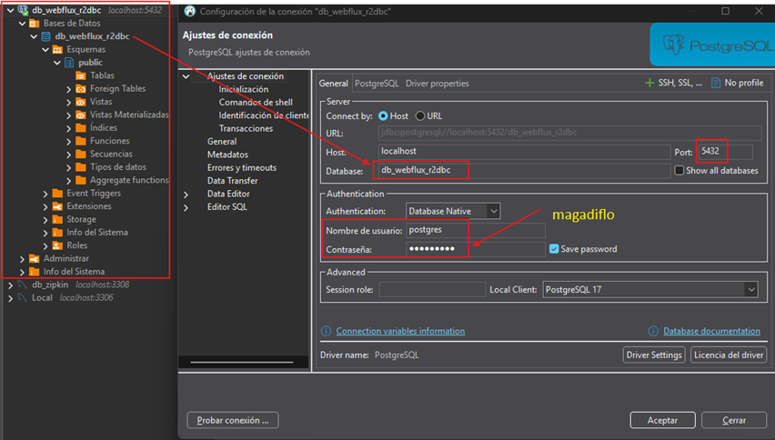
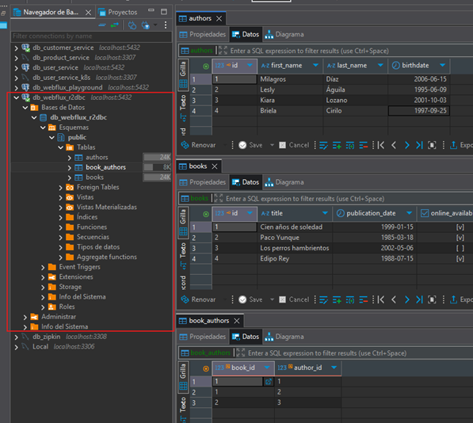

# [WebFlux R2DBC Crud using PostgreSQL](https://www.youtube.com/watch?v=s6qKE0FD3BU&t=2137s)

- Proyecto tomado del canal de youtube de `Joas Dev`.
- Este proyecto está actualizado (25/06/2025) con algunos detalles que se vieron en el curso de
  [java-reactive-programming](https://github.com/magadiflo/java-reactive-programming.git) y de
  [webFlux-masterclass-microservices](https://github.com/magadiflo/webFlux-masterclass-microservices.git).

---

## Dependencias

A continuación se muestran las dependencias utilizadas en este proyecto, de las cuales, la única dependencia que
agregamos manualmente fue [MapStruct](https://mapstruct.org/), las demás dependencias las agregamos desde
[Spring Initializr (ver dependencias)](https://start.spring.io/#!type=maven-project&language=java&platformVersion=3.5.3&packaging=jar&jvmVersion=21&groupId=dev.magadiflo&artifactId=webflux-r2dbc-crud&name=webflux-r2dbc-crud&description=Demo%20project%20for%20Spring%20WebFlux%20with%20r2dbc%20PostgreSQL&packageName=dev.magadiflo.r2dbc.app&dependencies=webflux,data-r2dbc,postgresql,lombok).

````xml
<!--Spring Boot 3.5.3-->
<!--Java 21-->
<!--org.mapstruct.version 1.6.3-->
<!--lombok-mapstruct-binding.version 0.2.0-->
<dependencies>
    <dependency>
        <groupId>org.springframework.boot</groupId>
        <artifactId>spring-boot-starter-data-r2dbc</artifactId>
    </dependency>
    <dependency>
        <groupId>org.springframework.boot</groupId>
        <artifactId>spring-boot-starter-webflux</artifactId>
    </dependency>

    <!--Agregado manualmente-->
    <dependency>
        <groupId>org.mapstruct</groupId>
        <artifactId>mapstruct</artifactId>
        <version>${org.mapstruct.version}</version>
    </dependency>
    <!--/Agregado manualmente-->
    <dependency>
        <groupId>org.postgresql</groupId>
        <artifactId>postgresql</artifactId>
        <scope>runtime</scope>
    </dependency>
    <dependency>
        <groupId>org.postgresql</groupId>
        <artifactId>r2dbc-postgresql</artifactId>
        <scope>runtime</scope>
    </dependency>
    <dependency>
        <groupId>org.projectlombok</groupId>
        <artifactId>lombok</artifactId>
        <optional>true</optional>
    </dependency>
    <dependency>
        <groupId>org.springframework.boot</groupId>
        <artifactId>spring-boot-starter-test</artifactId>
        <scope>test</scope>
    </dependency>
    <dependency>
        <groupId>io.projectreactor</groupId>
        <artifactId>reactor-test</artifactId>
        <scope>test</scope>
    </dependency>
</dependencies>
````

### Procesadores de anotaciones

- [Using MapStruct with Maven and Lombok.](https://bootify.io/spring-data/mapstruct-with-maven-and-lombok.html)
- [Using MapStruct With Lombok](https://www.baeldung.com/java-mapstruct-lombok)

Como vamos a trabajar con `MapStruct` necesitamos ampliar el `maven-compiler-plugin` para activar la generación de
código de `MapStruct`. Observar que nuestro primer procesador de anotaciones es `Lombok`, seguido directamente por
`MapStruct`. Se requiere otra referencia a `lombok-mapstruct-binding` para que estas dos bibliotecas funcionen juntas.
Sin `Lombok`, solo se necesitaría el `mapstruct-processor` en este momento.

````xml

<plugins>
    <!--MapStruct-->
    <plugin>
        <groupId>org.apache.maven.plugins</groupId>
        <artifactId>maven-compiler-plugin</artifactId>
        <version>${maven-compiler-plugin.version}</version>
        <configuration>
            <source>${java.version}</source>
            <target>${java.version}</target>
            <annotationProcessorPaths>
                <path>
                    <groupId>org.projectlombok</groupId>
                    <artifactId>lombok</artifactId>
                    <version>${lombok.version}</version>
                </path>
                <path>
                    <groupId>org.mapstruct</groupId>
                    <artifactId>mapstruct-processor</artifactId>
                    <version>${org.mapstruct.version}</version>
                </path>
                <path>
                    <groupId>org.projectlombok</groupId>
                    <artifactId>lombok-mapstruct-binding</artifactId>
                    <version>${lombok-mapstruct-binding.version}</version>
                </path>
            </annotationProcessorPaths>
        </configuration>
    </plugin>
    <!--/MapStruct-->
</plugins>
````

Es fácil cometer errores aquí, ya que los procesadores de anotaciones son una función avanzada. El principal error es
olvidar que nuestro entorno de ejecución buscará procesadores de anotaciones en el `path` o en el `classpath`, pero no
en ambas.

Debemos tener en cuenta que, a partir de la versión `1.18.16` de `Lombok` hacia arriba, necesitamos agregar tanto la
dependencia `lombok-mapstruct-binding` de `Lombok` como la dependencia `mapstruct-processor` en el elemento
`annotationProcessorPaths`. Si no lo hacemos, podríamos obtener un error de compilación:
`“Propiedad desconocida en el tipo de resultado…”`.

Necesitamos la dependencia `lombok-mapstruct-binding` para que `Lombok` y `MapStruct` funcionen juntos. En esencia,
le indica a `MapStruct` que espere hasta que `Lombok` haya completado todo el procesamiento de anotaciones antes
de generar clases de mapeador para los beans mejorados con `Lombok`.

## MapStruct vs ModelMapper

> En el proyecto original del tutorial de `Joas Dev` se usa como mapeador a `ModelMapper`, pero en mi caso, opté por
> usar `MapStruct` debido a las siguientes razones.

### ⚙️ MapStruct

- `Rendimiento superior`: Genera código de mapeo en tiempo de compilación, `evitando el uso de reflexión` y mejorando
  la velocidad.
- `Detección temprana de errores`: Al generar código en compilación, los errores de mapeo se detectan antes de ejecutar
  la aplicación.
- `Menor uso de memoria`: No usa reflection, lo que reduce la presión sobre el garbage collector.
- `Ideal para proyectos grandes o críticos en rendimiento`, como los que suelen construirse con `WebFlux`.
- `Más configuración inicial`, ya que debes definir interfaces y métodos de mapeo explícitamente.

### 🔄 ModelMapper

- `Más fácil de usar al principio`: Mapea automáticamente campos con nombres similares `usando reflexión`.
- Puede tener problemas con tipos genéricos complejos de los streams reactivos
- `Menor esfuerzo inicial`, útil para prototipos o proyectos pequeños.
- `Menor rendimiento`: La `reflexión` introduce una sobrecarga que puede ser significativa en aplicaciones reactivas.
- `Menos control` sobre el proceso de mapeo, lo que puede dificultar el mantenimiento a largo plazo.
- Los errores de configuración solo se detectan en runtime.
- Mayor consumo de memoria y CPU.

### ✅ Conclusión

Dado el enfoque en rendimiento, claridad y mantenimiento en sistemas reactivamente transaccionales, `MapStruct` encaja
mejor con el estilo y los objetivos. Además, al generar código explícito, facilita la documentación y el control del
flujo de datos.

## Creando base de datos

Creamos la base de datos `db_webflux_r2dbc` cuyo usuario es `postgres` y la contraseña es `magadiflo`.



## Configurando base de datos

En el `application.yml` agregamos las siguientes configuraciones.

````yml
server:
  port: 8080
  error:
    include-message: always

spring:
  application:
    name: webflux-r2dbc-crud
  r2dbc:
    url: r2dbc:postgresql://localhost:5432/db_webflux_r2dbc
    username: postgres
    password: magadiflo
````

La URL de conexión está configurada en `r2dbc:postgresql://localhost:5432/db_webflux_r2dbc`, donde:

- `r2dbc`, indicamos que usaremos `r2dbc` para conectarnos a la base de datos. Recordar que cuando usamos una
  aplicación tradicional como `Spring Boot MVC` (no reactiva) usamos `jdbc`.
- `db_webflux_r2dbc`, es el nombre de la base de datos.
- `5432`, es el puerto por defecto `PostgreSQL`.

Las propiedades `spring.r2dbc.username` y `spring.r2dbc.password` proporcionan las credenciales para conectarse a
la base de datos.

## Habilitando logging para ver los queries y parameters en las consultas a PostgreSQL

En el `application.yml` agregamos las siguientes configuraciones para poder observar qué instrucciones sql se están
ejecutando y qué parámetros se están enviando.

````yml
logging:
  level:
    io.r2dbc.postgresql.QUERY: DEBUG
    io.r2dbc.postgresql.PARAM: DEBUG
````

## Creando el esquema y datos de nuestra base de datos

Creamos el siguiente directorio `src/main/resources/sql` en nuestro proyecto. Aquí creamos el archivo `scheme.sql`
donde definimos las tablas `authors`, `books` y su relación de muchos a muchos `book_authors`.

Definimos las instrucciones `DROP TABLE...` al inicio de este script para que la aplicación inicie limpia y siempre
con los datos iniciales del archivo `data.sql` que crearemos más adelante.

````sql
DROP TABLE IF EXISTS book_authors;
DROP TABLE IF EXISTS authors;
DROP TABLE IF EXISTS books;

CREATE TABLE authors(
    id SERIAL,
    first_name VARCHAR(45) NOT NULL,
    last_name VARCHAR(45) NOT NULL,
    birthdate DATE NOT NULL,
    CONSTRAINT pk_authors PRIMARY KEY(id)
);

CREATE TABLE books(
    id SERIAL,
    title VARCHAR(255) NOT NULL,
    publication_date DATE NOT NULL,
    online_availability BOOLEAN DEFAULT FALSE,
    CONSTRAINT pk_books PRIMARY KEY(id)
);

CREATE TABLE book_authors(
    book_id INTEGER NOT NULL,
    author_id INTEGER NOT NULL,
    CONSTRAINT fk_books_book_authors FOREIGN KEY(book_id) REFERENCES books(id),
    CONSTRAINT fk_authors_book_authors FOREIGN KEY(author_id) REFERENCES authors(id),
    CONSTRAINT pk_book_authors PRIMARY KEY(book_id, author_id)
);
````

Creamos el script `data.sql` en el mismo directorio que el `scheme.sql`. En este script `data.sql` vamos a definir
los valores iniciales con las que iniciará nuestra aplicación cada vez que sea ejecutada.

````sql
INSERT INTO authors(first_name, last_name, birthdate)
VALUES
('Milagros', 'Díaz', '2006-06-15'),
('Lesly', 'Águila', '1995-06-09'),
('Kiara', 'Lozano', '2001-10-03'),
('Briela', 'Cirilo', '1997-09-25');

INSERT INTO books(title, publication_date, online_availability)
VALUES
('Cien años de soledad', '1999-01-15', true),
('Paco Yunque', '1985-03-18', true),
('Los perros hambrientos', '2002-05-06', false),
('Edipo Rey', '1988-07-15', true);

-- Book 1: tiene como author a Milagros y Lesly
INSERT INTO book_authors(book_id, author_id)
VALUES
(1, 1),
(1, 2);

-- Book 2: tiene como author a Kiara
INSERT INTO book_authors(book_id, author_id)
VALUES
(2, 3);
````

## Inicializando Scheme y Data

Crearemos una clase de configuración en `dev/magadiflo/r2dbc/app/config/DatabaseInitConfig.java` donde definiremos un
`@Bean` que nos retornará un objeto del tipo `ConnectionFactoryInitializer`.

`Spring Data R2DBC` `ConnectionFactoryInitializer` proporciona una manera conveniente de configurar e inicializar una
fábrica de conexiones para una conexión de base de datos reactiva en una aplicación `Spring`. Escaneará el
`scheme.sql` y el `data.sql` en el `classpath` y ejecutará los `scripts SQL` para inicializar la base de datos cuando
la base de datos esté conectada.

````java

@Configuration
public class DatabaseInitConfig {
    @Bean
    public ConnectionFactoryInitializer initializer(ConnectionFactory connectionFactory) {
        ClassPathResource schema = new ClassPathResource("sql/scheme.sql");
        ClassPathResource data = new ClassPathResource("sql/data.sql");
        ResourceDatabasePopulator resourceDatabasePopulator = new ResourceDatabasePopulator(schema, data);

        ConnectionFactoryInitializer initializer = new ConnectionFactoryInitializer();
        initializer.setConnectionFactory(connectionFactory);
        initializer.setDatabasePopulator(resourceDatabasePopulator);
        return initializer;
    }
}
````

Si hasta este punto ejecutamos la aplicación, veremos que el log nos muestra una ejecución exitosa.

````bash
  .   ____          _            __ _ _
 /\\ / ___'_ __ _ _(_)_ __  __ _ \ \ \ \
( ( )\___ | '_ | '_| | '_ \/ _` | \ \ \ \
 \\/  ___)| |_)| | | | | || (_| |  ) ) ) )
  '  |____| .__|_| |_|_| |_\__, | / / / /
 =========|_|==============|___/=/_/_/_/

 :: Spring Boot ::                (v3.5.3)

2025-06-26T12:00:08.010-05:00  INFO 3520 --- [webflux-r2dbc-crud] [           main] d.m.r.app.WebfluxR2dbcCrudApplication    : Starting WebfluxR2dbcCrudApplication using Java 21.0.6 with PID 3520 (D:\programming\spring\02.youtube\10.joas_dev\webflux-r2dbc-crud\target\classes started by magadiflo in D:\programming\spring\02.youtube\10.joas_dev\webflux-r2dbc-crud)
2025-06-26T12:00:08.016-05:00  INFO 3520 --- [webflux-r2dbc-crud] [           main] d.m.r.app.WebfluxR2dbcCrudApplication    : No active profile set, falling back to 1 default profile: "default"
2025-06-26T12:00:09.038-05:00  INFO 3520 --- [webflux-r2dbc-crud] [           main] .s.d.r.c.RepositoryConfigurationDelegate : Bootstrapping Spring Data R2DBC repositories in DEFAULT mode.
2025-06-26T12:00:09.074-05:00  INFO 3520 --- [webflux-r2dbc-crud] [           main] .s.d.r.c.RepositoryConfigurationDelegate : Finished Spring Data repository scanning in 18 ms. Found 0 R2DBC repository interfaces.
2025-06-26T12:00:10.703-05:00 DEBUG 3520 --- [webflux-r2dbc-crud] [actor-tcp-nio-1] io.r2dbc.postgresql.QUERY                : Executing query: SHOW TRANSACTION ISOLATION LEVEL
2025-06-26T12:00:10.714-05:00 DEBUG 3520 --- [webflux-r2dbc-crud] [actor-tcp-nio-1] io.r2dbc.postgresql.QUERY                : Executing query: SELECT oid, * FROM pg_catalog.pg_type WHERE typname IN ('hstore','geometry','vector')
2025-06-26T12:00:10.787-05:00 DEBUG 3520 --- [webflux-r2dbc-crud] [      Thread-16] io.r2dbc.postgresql.QUERY                : Executing query: DROP TABLE IF EXISTS book_authors
2025-06-26T12:00:10.796-05:00 DEBUG 3520 --- [webflux-r2dbc-crud] [actor-tcp-nio-2] io.r2dbc.postgresql.QUERY                : Executing query: SHOW TRANSACTION ISOLATION LEVEL
2025-06-26T12:00:10.798-05:00 DEBUG 3520 --- [webflux-r2dbc-crud] [actor-tcp-nio-2] io.r2dbc.postgresql.QUERY                : Executing query: SELECT oid, * FROM pg_catalog.pg_type WHERE typname IN ('hstore','geometry','vector')
2025-06-26T12:00:10.818-05:00 DEBUG 3520 --- [webflux-r2dbc-crud] [actor-tcp-nio-1] io.r2dbc.postgresql.QUERY                : Executing query: DROP TABLE IF EXISTS authors
2025-06-26T12:00:10.829-05:00 DEBUG 3520 --- [webflux-r2dbc-crud] [actor-tcp-nio-1] io.r2dbc.postgresql.QUERY                : Executing query: DROP TABLE IF EXISTS books
2025-06-26T12:00:10.836-05:00 DEBUG 3520 --- [webflux-r2dbc-crud] [actor-tcp-nio-1] io.r2dbc.postgresql.QUERY                : Executing query: CREATE TABLE authors( id SERIAL, first_name VARCHAR(45) NOT NULL, last_name VARCHAR(45) NOT NULL, birthdate DATE NOT NULL, CONSTRAINT pk_authors PRIMARY KEY(id) )
2025-06-26T12:00:10.860-05:00 DEBUG 3520 --- [webflux-r2dbc-crud] [actor-tcp-nio-3] io.r2dbc.postgresql.QUERY                : Executing query: SHOW TRANSACTION ISOLATION LEVEL
2025-06-26T12:00:10.861-05:00 DEBUG 3520 --- [webflux-r2dbc-crud] [actor-tcp-nio-3] io.r2dbc.postgresql.QUERY                : Executing query: SELECT oid, * FROM pg_catalog.pg_type WHERE typname IN ('hstore','geometry','vector')
2025-06-26T12:00:10.875-05:00 DEBUG 3520 --- [webflux-r2dbc-crud] [actor-tcp-nio-1] io.r2dbc.postgresql.QUERY                : Executing query: CREATE TABLE books( id SERIAL, title VARCHAR(255) NOT NULL, publication_date DATE NOT NULL, online_availability BOOLEAN DEFAULT FALSE, CONSTRAINT pk_books PRIMARY KEY(id) )
2025-06-26T12:00:10.882-05:00 DEBUG 3520 --- [webflux-r2dbc-crud] [actor-tcp-nio-1] io.r2dbc.postgresql.QUERY                : Executing query: CREATE TABLE book_authors( book_id INTEGER NOT NULL, author_id INTEGER NOT NULL, CONSTRAINT fk_books_book_authors FOREIGN KEY(book_id) REFERENCES books(id), CONSTRAINT fk_authors_book_authors FOREIGN KEY(author_id) REFERENCES authors(id), CONSTRAINT pk_book_authors PRIMARY KEY(book_id, author_id) )
2025-06-26T12:00:10.894-05:00 DEBUG 3520 --- [webflux-r2dbc-crud] [      Thread-17] io.r2dbc.postgresql.QUERY                : Executing query: INSERT INTO authors(first_name, last_name, birthdate) VALUES ('Milagros', 'Díaz', '2006-06-15'), ('Lesly', 'Águila', '1995-06-09'), ('Kiara', 'Lozano', '2001-10-03'), ('Briela', 'Cirilo', '1997-09-25')
2025-06-26T12:00:10.897-05:00 DEBUG 3520 --- [webflux-r2dbc-crud] [actor-tcp-nio-1] io.r2dbc.postgresql.QUERY                : Executing query: INSERT INTO books(title, publication_date, online_availability) VALUES ('Cien años de soledad', '1999-01-15', true), ('Paco Yunque', '1985-03-18', true), ('Los perros hambrientos', '2002-05-06', false), ('Edipo Rey', '1988-07-15', true)
2025-06-26T12:00:10.900-05:00 DEBUG 3520 --- [webflux-r2dbc-crud] [actor-tcp-nio-1] io.r2dbc.postgresql.QUERY                : Executing query: INSERT INTO book_authors(book_id, author_id) VALUES (1, 1), (1, 2)
2025-06-26T12:00:10.903-05:00 DEBUG 3520 --- [webflux-r2dbc-crud] [actor-tcp-nio-1] io.r2dbc.postgresql.QUERY                : Executing query: INSERT INTO book_authors(book_id, author_id) VALUES (2, 3)
2025-06-26T12:00:10.948-05:00 DEBUG 3520 --- [webflux-r2dbc-crud] [actor-tcp-nio-4] io.r2dbc.postgresql.QUERY                : Executing query: SHOW TRANSACTION ISOLATION LEVEL
2025-06-26T12:00:10.950-05:00 DEBUG 3520 --- [webflux-r2dbc-crud] [actor-tcp-nio-4] io.r2dbc.postgresql.QUERY                : Executing query: SELECT oid, * FROM pg_catalog.pg_type WHERE typname IN ('hstore','geometry','vector')
2025-06-26T12:00:11.055-05:00 DEBUG 3520 --- [webflux-r2dbc-crud] [actor-tcp-nio-5] io.r2dbc.postgresql.QUERY                : Executing query: SHOW TRANSACTION ISOLATION LEVEL
2025-06-26T12:00:11.057-05:00 DEBUG 3520 --- [webflux-r2dbc-crud] [actor-tcp-nio-5] io.r2dbc.postgresql.QUERY                : Executing query: SELECT oid, * FROM pg_catalog.pg_type WHERE typname IN ('hstore','geometry','vector')
2025-06-26T12:00:11.128-05:00 DEBUG 3520 --- [webflux-r2dbc-crud] [actor-tcp-nio-6] io.r2dbc.postgresql.QUERY                : Executing query: SHOW TRANSACTION ISOLATION LEVEL
2025-06-26T12:00:11.130-05:00 DEBUG 3520 --- [webflux-r2dbc-crud] [actor-tcp-nio-6] io.r2dbc.postgresql.QUERY                : Executing query: SELECT oid, * FROM pg_catalog.pg_type WHERE typname IN ('hstore','geometry','vector')
2025-06-26T12:00:11.237-05:00 DEBUG 3520 --- [webflux-r2dbc-crud] [actor-tcp-nio-7] io.r2dbc.postgresql.QUERY                : Executing query: SHOW TRANSACTION ISOLATION LEVEL
2025-06-26T12:00:11.239-05:00 DEBUG 3520 --- [webflux-r2dbc-crud] [actor-tcp-nio-7] io.r2dbc.postgresql.QUERY                : Executing query: SELECT oid, * FROM pg_catalog.pg_type WHERE typname IN ('hstore','geometry','vector')
2025-06-26T12:00:11.343-05:00 DEBUG 3520 --- [webflux-r2dbc-crud] [actor-tcp-nio-8] io.r2dbc.postgresql.QUERY                : Executing query: SHOW TRANSACTION ISOLATION LEVEL
2025-06-26T12:00:11.344-05:00 DEBUG 3520 --- [webflux-r2dbc-crud] [actor-tcp-nio-8] io.r2dbc.postgresql.QUERY                : Executing query: SELECT oid, * FROM pg_catalog.pg_type WHERE typname IN ('hstore','geometry','vector')
2025-06-26T12:00:11.432-05:00 DEBUG 3520 --- [webflux-r2dbc-crud] [actor-tcp-nio-1] io.r2dbc.postgresql.QUERY                : Executing query: SHOW TRANSACTION ISOLATION LEVEL
2025-06-26T12:00:11.435-05:00 DEBUG 3520 --- [webflux-r2dbc-crud] [actor-tcp-nio-1] io.r2dbc.postgresql.QUERY                : Executing query: SELECT oid, * FROM pg_catalog.pg_type WHERE typname IN ('hstore','geometry','vector')
2025-06-26T12:00:11.546-05:00 DEBUG 3520 --- [webflux-r2dbc-crud] [actor-tcp-nio-2] io.r2dbc.postgresql.QUERY                : Executing query: SHOW TRANSACTION ISOLATION LEVEL
2025-06-26T12:00:11.548-05:00 DEBUG 3520 --- [webflux-r2dbc-crud] [actor-tcp-nio-2] io.r2dbc.postgresql.QUERY                : Executing query: SELECT oid, * FROM pg_catalog.pg_type WHERE typname IN ('hstore','geometry','vector')
2025-06-26T12:00:11.893-05:00  INFO 3520 --- [webflux-r2dbc-crud] [           main] o.s.b.web.embedded.netty.NettyWebServer  : Netty started on port 8080 (http)
2025-06-26T12:00:11.919-05:00  INFO 3520 --- [webflux-r2dbc-crud] [           main] d.m.r.app.WebfluxR2dbcCrudApplication    : Started WebfluxR2dbcCrudApplication in 4.713 seconds (process running for 6.126)
````

Y si ahora revisamos la base de datos `db_webflux_r2dbc` en postgres, veremos que las tablas se han creado
y poblado correctamente.



## Creando entidades: Author, Book y BookAuthor

Creamos las entidades correspondientes a las tablas que definimos en el `scheme.sql`. Es importante recordar que aquí
estamos trabajando con `R2DBC`, por lo tanto hay que tener algunas consideraciones:

- No tenemos la anotación `@Entity` en `R2DBC`.
- Las anotaciones `@Table` o `@Column` realmente no son necesarios, pero si necesitamos agregar alguna personalización
  podemos usarlos. Por ejemplo, la anotación `@Table` nos permite redefinir el nombre de la tabla de la base de datos
  para cada entidad.
- La anotación `@Id` es necesaria para identificar la clave primaria de la entidad.
- A diferencia de `JPA`, `R2DBC` no maneja automáticamente las relaciones entre entidades (no hay `@OneToMany`,
  `@ManyToOne`, etc.).

````java

@ToString
@AllArgsConstructor
@NoArgsConstructor
@Builder
@Data
@Table(name = "authors")
public class Author {
    @Id
    private Integer id;
    private String firstName;
    private String lastName;
    private LocalDate birthdate;
}
````

````java

@ToString
@AllArgsConstructor
@NoArgsConstructor
@Builder
@Data
@Table(name = "books")
public class Book {
    @Id
    private Integer id;
    private String title;
    private LocalDate publicationDate;
    private Boolean onlineAvailability;
}
````

````java

@ToString
@AllArgsConstructor
@NoArgsConstructor
@Builder
@Data
@Table(name = "book_authors")
public class BookAuthor {
    private Integer bookId;
    private Integer authorId;
}
````

### ⚠️ Nota sobre Relaciones Muchos a Muchos en R2DBC

La tabla `book_authors` representa una **relación muchos a muchos** entre `Author` y `Book`:

- Un autor puede escribir muchos libros
- Un libro puede ser escrito por muchos autores

### Diseño de Base de Datos

Para esta relación `M:N`, hemos implementado una **clave primaria compuesta** que sigue el modelo relacional puro:

```sql
CREATE TABLE book_authors(
    book_id INTEGER NOT NULL,
    author_id INTEGER NOT NULL,
    CONSTRAINT fk_books_book_authors FOREIGN KEY(book_id) REFERENCES books(id),
    CONSTRAINT fk_authors_book_authors FOREIGN KEY(author_id) REFERENCES authors(id),
    CONSTRAINT pk_book_authors PRIMARY KEY(book_id, author_id) --Clave primaria compuesta
);
```

Este diseño:

- ✅ `Garantiza unicidad`: No permite relaciones duplicadas.
- ✅ `Es semánticamente correcto`: La PK representa exactamente la relación.
- ✅ `Sigue el modelo relacional puro`: Sin campos artificiales innecesarios.

### Limitación de R2DBC

`Spring Data R2DBC no soporta claves primarias compuestas` (a diferencia de JPA que tiene @IdClass y @EmbeddedId).
Por esta razón:

1. No podemos usar `ReactiveCrudRepository` para esta entidad.
2. Debemos usar `DatabaseClient` con `SQL nativo` para las operaciones `CRUD`.
3. Creamos una entidad `BookAuthor` `sin anotación @Id` para representar la tabla.

Esta aproximación nos permite mantener el diseño teóricamente correcto en base de datos mientras trabajamos con las
limitaciones actuales de `R2DBC`.

### ⚠️ Importante

> Si quisiéramos utilizar `ReactiveCrudRepository` con la entidad `BookAuthor`, sería necesario agregar una columna
> adicional en la tabla `book_authors`, como un identificador único (por ejemplo, `id SERIAL PRIMARY KEY`).
> Esta nueva columna actuaría como clave primaria y permitiría anotar un atributo correspondiente en la entidad
> con `@Id`.
>
> Sin embargo, al introducir una clave artificial, la tabla dejaría de representar un modelo relacional
> puramente compuesto, rompiendo en cierta forma con la normalización clásica de una relación muchos a muchos.
>
> Este caso lo podemos ver en el proyecto
> [webFlux-masterclass-microservices](https://github.com/magadiflo/webFlux-masterclass-microservices/tree/main/projects/webflux-playground/src/main/java/dev/magadiflo/app/sec03/entity)

## Creando repositorios

A nuestras entidades `Author` y `Book` les crearemos a cada uno su interfaz de repositorio. Estos repositorios nos
permitirán interactuar con las tablas de la base de datos `authors` y `books`. Con respecto a la entidad `BookAuthor`,
esta la manejaremos dentro de una clase `dao` haciendo uso del `DatabaseClient`.

La interfaz `ReactiveCrudRepository` nos permitirá usar sus métodos ya definidos, tales como el `save()`, `findById()`,
`findAll()`, `count()`, `delete()`, `deleteById()`, `deleteAll()`, etc.`

A continuación se muestra la creación del repositorio `BookRepository` para la entidad `Book`.

````java
public interface BookRepository extends ReactiveCrudRepository<Book, Integer> {
}
````

Antes de crear el repositorio `AuthorRepository` vamos a crear una proyección basada en interfaz que luego la usaremos
en algunos métodos del repositorio.

Crearemos la interfaz de proyección `AuthorProjection` que será utilizada en `Spring Data R2DBC` para exponer datos
de la entidad `Author` de manera optimizada en respuestas JSON, evitando la necesidad de crear un `DTO` separado.

````java

@JsonPropertyOrder(value = {"firstName", "lastName", "fullName", "birthdate"})
public interface AuthorProjection {
    String getFirstName();

    String getLastName();

    LocalDate getBirthdate();

    default String getFullName() {
        if (Objects.isNull(getFirstName()) || Objects.isNull(getLastName())) {
            return "";
        }
        return "%s %s".formatted(getFirstName(), getLastName());
    }
}
````

Esta interfaz utiliza la anotación `@JsonPropertyOrder(value = {"firstName", "lastName", "fullName", "birthdate"})`
para ordenar explícitamente los campos en la respuesta JSON en el orden indicado.

Sin esta anotación:

- Jackson no garantiza el orden de los campos.
- El orden puede cambiar entre ejecuciones, versiones de Spring, o versiones de Jackson.
- Campos default como fullName suelen aparecer en posiciones impredecibles.

Con esta anotación:

- La respuesta JSON mantiene siempre un orden estable.
- Se mejora la claridad para clientes y frontends.
- Se facilita la validación en tests automatizados.

### ✨ Nota importante

> La anotación `@JsonPropertyOrder` solo es necesaria en `interfaces` de proyección, ya que en estas el orden de las
> propiedades no está garantizado por defecto y puede variar.
>
> Si en lugar de una interfaz usamos un `record` o una `clase` DTO convencional, no necesitamos esta anotación, ya que
> en un `record`, el orden de los campos en el JSON coincide con el orden en que se definen los componentes del record.
> En una clase, Jackson respeta el orden en que declares los atributos.

> Más adelante explicamos en detalle qué es esto de las `proyecciones`.

Ahora, mostramos la creación del repositorio `AuthorRepository` para la entidad `Author`. Algo que vamos a hacer en
este repositorio es que a pesar de que el `ReactiveCrudRepository` ya viene con métodos predefinidos como el
`save()`, `findBYId()`, etc. en nuestro caso vamos a definir nuestros propios métodos para practicar un poco.

````java
public interface AuthorRepository extends ReactiveCrudRepository<Author, Integer> {
    /**
     * @param author entity
     * @return affectedRows
     */
    @Modifying
    @Query(value = """
            INSERT INTO authors(first_name, last_name, birthdate)
            VALUES(:#{#author.firstName}, :#{#author.lastName}, :#{#author.birthdate})
            """)
    Mono<Integer> saveAuthor(@Param("author") Author author);

    /**
     * @param author entity
     * @return affectedRows
     */
    @Modifying
    @Query(value = """
            UPDATE authors
            SET first_name = :#{#author.firstName},
                last_name = :#{#author.lastName},
                birthdate = :#{#author.birthdate}
            WHERE id = :#{#author.id}
            """)
    Mono<Integer> updateAuthor(Author author);

    @Query("""
            SELECT a.id, a.first_name, a.last_name, a.birthdate
            FROM authors AS a
            WHERE a.id IN(:authorIds)
            """)
    Flux<Author> findAllAuthorsByIdIn(List<Integer> authorIds);

    @Query("""
            SELECT COUNT(a.id)
            FROM authors AS a
            WHERE a.first_name LIKE :#{'%' + #query + '%'}
                OR a.last_name LIKE :#{'%' + #query + '%'}
            """)
    Mono<Integer> findCountByQuery(String query);

    @Query("""
            SELECT a.id, a.first_name, a.last_name, a.birthdate
            FROM authors AS a
            WHERE a.id = :authorId
            """)
    Mono<AuthorProjection> findAuthorById(Integer authorId);

    @Query("""
            SELECT a.id, a.first_name, a.last_name, a.birthdate
            FROM authors AS a
            WHERE a.first_name LIKE :#{'%' + #query + '%'}
                OR a.last_name LIKE :#{'%' + #query + '%'}
            ORDER BY a.id ASC
            LIMIT :#{#pageable.getPageSize()}
            OFFSET :#{#pageable.getOffset()}
            """)
    Flux<AuthorProjection> findByQuery(String query, Pageable pageable);

    @Modifying
    @Query("DELETE FROM authors AS a WHERE a.id = :authorId")
    Mono<Boolean> deleteAuthorById(Integer authorId);
}
````

En el repositorio `AuthorRepository` hemos definido métodos personalizados, donde:

- Usamos la anotación `@Query()` para definir nuestra consulta.


- La consulta usada en la anotación `@Query()` es `SQL nativo`, ya que estamos trabajando con `Spring Data R2DBC`
  y no con `Spring Data JPA`. Aunque dicho sea de paso, con `Spring Data JPA` también se puede trabajar con `SQL nativo`
  solo que en ese caso es necesario agregar el atributo `nativeQuery` en la anotación de la siguiente manera
  `@Query(value = "TU_CONSULTA_SQL_CON_JPA", nativeQuery = true)`, mientras que con `Spring Data R2DBC` usamos
  directamente `SQL nativo` en la anotación `@Query`.


- La anotación `@Modifying` indica que un método de consulta debe considerarse una consulta de modificación que puede
  devolver:
    - `Void` para descartar el recuento de actualizaciones y esperar a que se complete.
    - `Integer` u otro tipo numérico que emite el recuento de filas afectadas.
    - `Boolean` para indicar si se actualizó al menos una fila.

  Los métodos de consulta anotados con `@Modifying` suelen ser instrucciones `INSERT, UPDATE, DELETE y DDL` que no
  devuelven resultados tabulares.


- Normalmente, cuando definimos parámetros a nuestros métodos de repositorio, si son pocos parámetros podemos definirlos
  uno a uno, pero si son muchos parámetros, podemos pasarle directamente un objeto que tendrá las propiedades que
  usaremos en la consulta. En nuestro caso, observemos la firma de nuestro método `saveAuthor()`
  `Mono<Integer> saveAuthor(@Param("author") Author author)`, le estamos pasando la clase `Author`.


- Para usar las propiedades del objeto pasado por parámetro dentro de la consulta SQL usamos `SpEL`, por ejemplo:
  `:#{#author.firstName}`, donde `author` es el parámetro definido en el método y `firstName` es la propiedad del
  objeto. Esta sintaxis se utiliza para acceder a expresiones `SpEL (Spring Expression Language)`. Permite referenciar
  propiedades y métodos de objetos directamente en la consulta.


- El prefijo `#{}` indica que se está utilizando `SpEL`, y el símbolo `#` se utiliza para acceder a los parámetros del
  método o a las propiedades del objeto. Por ejemplo. `:#{#pageable.getPageSize()}` accede al método `getPageSize()` del
  objeto `Pageable` pasado como parámetro.

Veamos un poco más a detalle la siguiente consulta que hemos creado anteriormente.

````java

@Query("""
        SELECT a.first_name, a.last_name, a.birthdate
        FROM authors AS a
        WHERE a.first_name LIKE :#{'%' + #query + '%'}
            OR a.last_name LIKE :#{'%' + #query + '%'}
        ORDER BY a.id ASC
        LIMIT :#{#pageable.getPageSize()}
        OFFSET :#{#pageable.getOffset()}
        """)
Flux<AuthorProjection> findByQuery(String query, Pageable pageable);
````

Estamos pasando por parámetro un `String query` y un `Pageable pageable`. Centrémonos en el objeto `pageable`. Estamos
agregando este objeto `pageable` por parámetro con la única finalidad de poder usar los valores internos que nos
proporcione su implementación. En otras palabras, lo que pasamos por parámetro al método `findByQuery(...)` es la
variable `query` y la implementación de la interfaz `Pageable`. Esta implementación la podemos obtener de un
`PageRequest.of(pageNumber, pageSize)`. Internamente, la implementación hace ciertas operaciones, las mismas que
podemos obtenerlas, por ejemplo con el `getOffset()` que es la multiplicación del `pageNumber * pageSize`.

Por otro lado, algo importante que se debe resaltar en las consultas personalizadas del repositorio anterior es que en
los métodos `findAuthorById` y `findByQuery` estamos usando el concepto de `Projections` (a modo de ejemplo), con
`projections` podemos recuperar del total de columnas que tenga una tabla, solo las columnas que queramos. Por ejemplo,
si nuestra tabla tuviera 50 columnas, con projections podemos recuperar solo 5 columnas, no todas, sino las que son
realmente necesarias.

A continuación, veamos el tema más detalladamente:

### [Projections](https://docs.spring.io/spring-data/jpa/reference/repositories/projections.html)

Los métodos de consulta de Spring Data generalmente devuelven una o varias instancias de la raíz agregada administrada
por el repositorio. Sin embargo, a veces puede resultar conveniente crear proyecciones basadas en ciertos atributos de
esos tipos. `Spring Data` permite modelar tipos de retorno dedicados para recuperar de manera más selectiva vistas
parciales de los agregados administrados.

> Supongamos que tenemos una entidad con múchos atributos, unas 100 por ejemplo (por exagerar). Ahora, imagine que
> queremos recuperar únicamente 3 atributos ¿cómo lo haríamos?

### Proyecciones basadas en interfaz

La forma más sencilla de limitar el resultado de las consultas solo a los atributos seleccionados es declarando una
interfaz que exponga los métodos de acceso para que se lean las propiedades, como se muestra en el siguiente ejemplo:

Supongamos que tenemos el siguiente repositorio y su aggregate root:

````java
class Person {
    @Id
    UUID id;
    String firstname;
    String lastname;
    Address address;

    static class Address {
        String zipCode, city, street;
    }
}

interface PersonRepository extends Repository<Person, UUID> {
    Collection<Person> findByLastname(String lastname);
}
````

Ahora, usando **proyecciones basadas en interfaz** definimos únicamente los atributos que queremos recuperar, por
ejemplo, recuperar únicamente los atributos del nombre de la persona:

````java
interface NamesOnly {
    String getFirstname();

    String getLastname();
}
````

Lo importante aquí es que las propiedades definidas aquí coinciden exactamente con las propiedades del aggregate root.
Al hacerlo, se puede agregar un método de consulta de la siguiente manera:

````java
// Un repositorio que utiliza una proyección basada en interfaz con un método de consulta
interface PersonRepository extends Repository<Person, UUID> {
    Collection<NamesOnly> findByLastname(String lastname);
}
````

#### Proyecciones cerradas

Una interfaz de proyección cuyos métodos de acceso coinciden con las propiedades del agregado de destino se considera
una proyección cerrada. El siguiente ejemplo (que también utilizamos anteriormente en este capítulo) es una proyección
cerrada.

````java
interface NamesOnly {
    String getFirstname();

    String getLastname();
}
````

#### Proyecciones abiertas

Los métodos de acceso en las interfaces de proyección también se pueden utilizar para calcular nuevos valores mediante
la anotación @Value, como se muestra en el siguiente ejemplo:

````java
interface NamesOnly {
    @Value("#{target.firstname + ' ' + target.lastname}")
    String getFullName();
    /*...*/
}
````

La raíz agregada que respalda la proyección está disponible en la variable objetivo. Una interfaz de proyección que
utiliza `@Value` es una `proyección abierta`. Spring Data no puede aplicar optimizaciones de ejecución de consultas en
este caso, porque la expresión `SpEL` podría usar cualquier atributo de la raíz agregada.

Las expresiones utilizadas en `@Value` no deben ser demasiado complejas; debe evitar la programación en variables de
cadena. Para expresiones muy simples, una opción podría ser recurrir a métodos predeterminados (introducidos en Java 8),
como se muestra en el siguiente ejemplo:

````java
// Una interfaz de proyección que utiliza un método predeterminado para lógica personalizada
interface NamesOnly {

    String getFirstname();

    String getLastname();

    default String getFullName() {
        return getFirstname().concat(" ").concat(getLastname());
    }
}
````

## Prueba de Integración a repositorio

Vamos a crear dos archivos en nuestro classpath de `/test` que contendrán las instrucciones sql que ejecutaremos en cada
método de test de nuestro repositorio.

`src/test/resources/sql/data.sql`

````sql
INSERT INTO authors(first_name, last_name, birthdate)
VALUES
('Belén', 'Velez', '2006-06-15'),
('Marco', 'Salvador', '1995-06-09'),
('Greys', 'Briones', '2001-10-03'),
('Luis', 'Sánchez', '1997-09-25');

INSERT INTO books(title, publication_date, online_availability)
VALUES
('Los ríos profundos', '1999-01-15', true),
('La ciudad y los perros', '1985-03-18', true),
('El zorro de arriba y el zorro de abajo', '2002-05-06', false),
('Redoble por Rancas', '1988-07-15', true);

-- Book 1: tiene como author a Belén y Marco
INSERT INTO book_authors(book_id, author_id)
VALUES
(1, 1),
(1, 2);

-- Book 2: tiene como author a Greys
INSERT INTO book_authors(book_id, author_id)
VALUES
(2, 3);
````

`src/test/resources/sql/reset_test_data.sql`

````sql
TRUNCATE TABLE book_authors RESTART IDENTITY CASCADE;
TRUNCATE TABLE books RESTART IDENTITY CASCADE;
TRUNCATE TABLE authors RESTART IDENTITY CASCADE;
````

La siguiente clase abstracta sirve como `base de configuración` común para los tests que usen `@DataR2dbcTest`,
facilitando:

- La carga y ejecución de scripts SQL antes de cada test para tener una base de datos en estado limpio.
- La inyección automática del DatabaseClient para ejecutar directamente sentencias SQL reactivas.
- Reutilización de lógica para inicializar datos comunes de prueba (`data.sql` y `reset_test_data.sql`).

La anotación `@DataR2dbcTest`:

- Habilita solo los componentes de persistencia reactiva necesarios para probar con `R2DBC`.
- Configura una base de datos embebida o el `datasource configurado`.
- Excluye componentes Web, Beans externos, Controllers, etc.

> ✅ Ideal para pruebas de repositorios (`ReactiveCrudRepository`, `R2dbcEntityTemplate`, etc.) de forma rápida y
> aislada.

La inyección de `DatabaseClient`:

- Permite ejecutar queries SQL de forma reactiva (no bloqueante).
- Es útil para cargar directamente scripts SQL que no están acoplados a entidades.

````java

@DataR2dbcTest
public abstract class AbstractTest {

    @Autowired
    private DatabaseClient databaseClient;
    private static String dataSQL;
    private static String resetTestData;

    @BeforeAll
    static void beforeAll() throws IOException {
        resetTestData = getSQL(new ClassPathResource("sql/reset_test_data.sql"));
        dataSQL = getSQL(new ClassPathResource("sql/data.sql"));
    }

    @BeforeEach
    void setUp() {
        this.executeSQL(resetTestData);
        this.executeSQL(dataSQL);
    }

    private static String getSQL(ClassPathResource resource) throws IOException {
        try (InputStream inputStream = resource.getInputStream()) {
            return new String(inputStream.readAllBytes(), StandardCharsets.UTF_8);
        }
    }

    private void executeSQL(String sql) {
        this.databaseClient.sql(sql)
                .fetch()
                .rowsUpdated()
                .block(); //Aunque se usa block(), está justificado aquí porque estás en una clase de prueba que no necesita mantener la naturaleza reactiva pura.
    }
}
````

La clase `AbstractTest` sirve como clase base para los test de repositorios reactivos con R2DBC. Utiliza la anotación
`@DataR2dbcTest` para limitar el contexto a los beans de persistencia necesarios, acelerando la ejecución de pruebas.

Antes de todos los tests, se cargan los scripts `reset_test_data.sql` y `data.sql` desde el classpath.
Luego, antes de cada método de test, se ejecutan estos scripts para garantizar un entorno limpio y reproducible. Esto
asegura que los tests no dependan del orden de ejecución o del estado de datos compartido.

Finalmente, creamos la clase principal de pruebas para nuestro repositorio `AuthorRepositoryTest`. Esta clase hereda
las configuraciones que definimos en la clase abstracta anterior. Entonces:

- Hereda la configuración base de `AbstractTest`.
    - Carga y resetea datos antes de cada test.
    - Usa un contexto limitado de `@DataR2dbcTest`.

````java

@Slf4j
class AuthorRepositoryTest extends AbstractTest {

    @Autowired
    private AuthorRepository authorRepository;

    @Test
    void findAllAuthors() {
        this.authorRepository.findAllAuthorsByIdIn(List.of(2, 3))
                .doOnNext(author -> log.info("{}", author))
                .as(StepVerifier::create)
                .assertNext(author -> {
                    Assertions.assertEquals(2, author.getId());
                    Assertions.assertEquals("Marco", author.getFirstName());
                    Assertions.assertEquals("Salvador", author.getLastName());
                    Assertions.assertEquals(LocalDate.parse("1995-06-09"), author.getBirthdate());
                })
                .assertNext(author -> {
                    Assertions.assertEquals(3, author.getId());
                    Assertions.assertEquals("Greys", author.getFirstName());
                    Assertions.assertEquals("Briones", author.getLastName());
                    Assertions.assertEquals(LocalDate.parse("2001-10-03"), author.getBirthdate());
                })
                .verifyComplete();
    }

    @Test
    void findAuthorById() {
        this.authorRepository.findAuthorById(1)
                .doOnNext(authorProjection -> log.info("{}", authorProjection))
                .as(StepVerifier::create)
                .assertNext(authorProjection -> {
                    Assertions.assertEquals("Belén", authorProjection.getFirstName());
                    Assertions.assertEquals("Velez", authorProjection.getLastName());
                    Assertions.assertEquals(LocalDate.parse("2006-06-15"), authorProjection.getBirthdate());

                    // Comprobamos que el método por defecto de la proyección está funcionando
                    Assertions.assertEquals("Belén Velez", authorProjection.getFullName());
                })
                .verifyComplete();
    }

    @Test
    void findCountByQuery() {
        this.authorRepository.findCountByQuery("e")
                .as(StepVerifier::create)
                .assertNext(count -> Assertions.assertEquals(3, count))
                .verifyComplete();
    }

    @Test
    void findByQueryAndPageable() {
        this.authorRepository.findByQuery("e", PageRequest.of(0, 2))
                .doOnNext(authorProjection -> log.info("{}", authorProjection))
                .as(StepVerifier::create)
                .assertNext(authorProjection -> {
                    Assertions.assertEquals("Belén", authorProjection.getFirstName());
                    Assertions.assertEquals("Velez", authorProjection.getLastName());
                    Assertions.assertEquals(LocalDate.parse("2006-06-15"), authorProjection.getBirthdate());
                    //default method
                    Assertions.assertEquals("Belén Velez", authorProjection.getFullName());
                })
                .assertNext(authorProjection -> {
                    Assertions.assertEquals("Greys", authorProjection.getFirstName());
                    Assertions.assertEquals("Briones", authorProjection.getLastName());
                    Assertions.assertEquals(LocalDate.parse("2001-10-03"), authorProjection.getBirthdate());
                    //default method
                    Assertions.assertEquals("Greys Briones", authorProjection.getFullName());
                })
                .verifyComplete();
    }

    @Test
    void saveAuthor() {
        Author author = Author.builder()
                .firstName("Susana")
                .lastName("Alvarado")
                .birthdate(LocalDate.parse("2000-11-07"))
                .build();
        this.authorRepository.saveAuthor(author)
                .doOnNext(affectedRows -> log.info("affectedRows: {}", affectedRows))
                .as(StepVerifier::create)
                .assertNext(affectedRows -> Assertions.assertEquals(1, affectedRows))
                .verifyComplete();

        this.authorRepository.count()
                .as(StepVerifier::create)
                .expectNext(5L)
                .verifyComplete();

        this.authorRepository.findById(5)
                .doOnNext(authorRetrieved -> log.info("{}", authorRetrieved))
                .as(StepVerifier::create)
                .assertNext(authorRetrieved -> {
                    Assertions.assertNotNull(authorRetrieved.getId());
                    Assertions.assertEquals("Susana", authorRetrieved.getFirstName());
                    Assertions.assertEquals("Alvarado", authorRetrieved.getLastName());
                    Assertions.assertEquals(LocalDate.parse("2000-11-07"), authorRetrieved.getBirthdate());
                })
                .verifyComplete();

        this.authorRepository.deleteById(5)
                .then(this.authorRepository.count())
                .as(StepVerifier::create)
                .expectNext(4L)
                .verifyComplete();
    }

    @Test
    void updateCustomer() {
        this.authorRepository.findById(1)
                .doOnNext(author -> log.info("{}", author))
                .doOnNext(author -> author.setFirstName("Belencita"))
                .flatMap(author -> this.authorRepository.updateAuthor(author))
                .as(StepVerifier::create)
                .assertNext(affectedRows -> Assertions.assertEquals(1, affectedRows))
                .verifyComplete();

        this.authorRepository.findById(1)
                .doOnNext(author -> log.info("{}", author))
                .as(StepVerifier::create)
                .assertNext(author -> Assertions.assertEquals("Belencita", author.getFirstName()))
                .verifyComplete();
    }
}
````

## Creando DTOS

A continuación mostramos los dtos creados usando `record`. Los primeros records creados son para las
consultas que realizaremos usando `criteria`, es decir consultas que serán elaboradas de manera dinámica.

````java
public record BookCriteria(String query, LocalDate publicationDate) {
}
````

````java
public record AuthorCriteria(String firstName, String lastName) {
}
````

````java
public record AuthorFilter(String query) {
}
````

````java
public record AuthorRequest(String firstName,
                            String lastName,
                            LocalDate birthdate) {
}
````

````java
public record RegisterBook(String title,
                           LocalDate publicationDate,
                           Boolean onlineAvailability,
                           List<Integer> authors) {
    public RegisterBook { // Constructor compacto
        onlineAvailability = Boolean.TRUE.equals(onlineAvailability); // Valor por defecto false si el onlineAvailability es null
    }
}
````

## Creando Servicios

Definimos la interfaz para la entidad `Author`.

````java
public interface AuthorService {
    Flux<AuthorResponse> findAllAuthors();

    Mono<AuthorProjection> findAuthorById(Integer authorId);

    Mono<Page<AuthorProjection>> getAllAuthorsToPage(String query, int pageNumber, int pageSize);

    Mono<Integer> saveAuthor(Mono<AuthorRequest> authorRequestMono);

    Mono<AuthorProjection> updateAuthor(Integer authorId, Mono<AuthorRequest> authorRequestMono);

    Mono<Boolean> deleteAuthor(Integer authorId);
}
````

Implementamos la clase de servicio `AuthorServiceImpl`.

````java

@Slf4j
@RequiredArgsConstructor
@Service
public class AuthorServiceImpl implements AuthorService {

    private final AuthorRepository authorRepository;
    private final AuthorMapper authorMapper;

    @Override
    @Transactional(readOnly = true)
    public Flux<AuthorResponse> findAllAuthors() {
        return this.authorRepository.findAll()
                .map(this.authorMapper::toAuthorResponse);
    }

    @Override
    @Transactional(readOnly = true)
    public Mono<AuthorProjection> findAuthorById(Integer authorId) {
        return this.authorRepository.findAuthorById(authorId)
                .switchIfEmpty(ApplicationExceptions.authorNotFound(authorId));
    }

    @Override
    @Transactional(readOnly = true)
    public Mono<Page<AuthorProjection>> getAllAuthorsToPage(String query, int pageNumber, int pageSize) {
        Pageable pageable = PageRequest.of(pageNumber, pageSize);
        return Mono.zip(
                this.authorRepository.findByQuery(query, pageable).collectList(),
                this.authorRepository.findCountByQuery(query),
                (data, total) -> new PageImpl<>(data, pageable, total)
        );
    }

    @Override
    @Transactional
    public Mono<Integer> saveAuthor(Mono<AuthorRequest> authorRequestMono) {
        return authorRequestMono
                .map(this.authorMapper::toAuthor)
                .flatMap(this.authorRepository::saveAuthor);
    }

    @Override
    @Transactional
    public Mono<AuthorProjection> updateAuthor(Integer authorId, Mono<AuthorRequest> authorRequestMono) {
        return this.authorRepository.findById(authorId)
                .flatMap(author -> authorRequestMono)
                .map(this.authorMapper::toAuthor)
                .doOnNext(author -> author.setId(authorId))
                .flatMap(this.authorRepository::updateAuthor)
                .flatMap(affectedRows -> this.authorRepository.findAuthorById(authorId))
                .switchIfEmpty(ApplicationExceptions.authorNotFound(authorId));
    }

    @Override
    @Transactional
    public Mono<Boolean> deleteAuthor(Integer authorId) {
        return this.authorRepository.findById(authorId)
                .flatMap(author -> this.authorRepository.deleteAuthorById(authorId))
                .switchIfEmpty(ApplicationExceptions.authorNotFound(authorId));
    }
}
````

## 📄 Anotación `@Transactional` en aplicaciones reactivas con Spring WebFlux y R2DBC

### 🎯 Objetivo General

Verificar y documentar el uso de la anotación `@Transactional` en aplicaciones reactivas, específicamente en un
proyecto con:

- Spring WebFlux
- Spring Data R2DBC
- PostgreSQL

Se sabe de antemano que:

> ✅ La anotación `@Transactional` funciona correctamente en aplicaciones reactivas para delimitar transacciones que
> modifican la base de datos (`INSERT`, `UPDATE`, `DELETE`).

⚠️ El enfoque de estas pruebas fue comprobar específicamente que `@Transactional(readOnly = true)` efectivamente
bloquea escrituras.

Para ello se diseñaron experimentos que forzaran un `INSERT` bajo una transacción marcada como de `solo lectura`.

### ⚙️ Entorno de Pruebas

- Spring Boot: 3.5.3
- Spring Data R2DBC: versión incluida en Spring Boot 3.5.3
- Driver R2DBC: io.r2dbc:r2dbc-postgresql
- Base de datos: PostgreSQL
- Configuración adicional:
    - Únicamente propiedades de conexión en application.yml
    - Logs SQL habilitados
    - Sin TransactionManager personalizado

### 🧪 Pruebas realizadas

A continuación se detallan las pruebas y resultados.

### 🟢 1️⃣ Prueba `SIN` `@Transactional(readOnly = true)`

📌 Código del método

````java

@Override
public Flux<AuthorResponse> findAllAuthors() {
    return this.authorRepository.save(Author.builder()
                    .firstName("Ale")
                    .lastName("Flo")
                    .birthdate(LocalDate.parse("2025-05-06"))
                    .build())
            .doOnNext(author -> log.info("{}", author))
            .flatMapMany(author -> this.authorRepository.findAll())
            .map(this.authorMapper::toAuthorResponse);
}
````

📋 Resultado observado

- Se ejecutó correctamente un INSERT.
- Luego se ejecutó el SELECT de todos los autores.
- La respuesta incluyó el autor recién insertado.
- No se produjo ningún error.

Log en el Ide

````bash
io.r2dbc.postgresql.PARAM                : Bind parameter [0] to: Ale
io.r2dbc.postgresql.PARAM                : Bind parameter [1] to: Flo
io.r2dbc.postgresql.PARAM                : Bind parameter [2] to: 2025-05-06
io.r2dbc.postgresql.QUERY                : Executing query: INSERT INTO authors (first_name, last_name, birthdate) VALUES ($1, $2, $3) RETURNING id
d.m.r.a.service.impl.AuthorServiceImpl   : Author(id=5, firstName=Ale, lastName=Flo, birthdate=2025-05-06)
io.r2dbc.postgresql.QUERY                : Executing query: SELECT authors.* FROM authors
````

Log en el cliente

````bash
$ curl -v http://localhost:8080/api/v1/authors/stream
>
< HTTP/1.1 200 OK
< transfer-encoding: chunked
< Content-Type: text/event-stream;charset=UTF-8
<
data:{"id":1,"firstName":"Milagros","lastName":"Díaz","birthdate":"2006-06-15"}

data:{"id":2,"firstName":"Lesly","lastName":"Águila","birthdate":"1995-06-09"}

data:{"id":3,"firstName":"Kiara","lastName":"Lozano","birthdate":"2001-10-03"}

data:{"id":4,"firstName":"Briela","lastName":"Cirilo","birthdate":"1997-09-25"}

data:{"id":5,"firstName":"Ale","lastName":"Flo","birthdate":"2025-05-06"}
````

✅ Conclusión:
> El método `sin readOnly` permite insertar datos normalmente.

### 🔵 2️⃣ Prueba `CON` `@Transactional(readOnly = true)`

📌 Código del método

````java

@Override
@Transactional(readOnly = true)
public Flux<AuthorResponse> findAllAuthors() {
    return this.authorRepository.save(Author.builder()
                    .firstName("Ale")
                    .lastName("Flo")
                    .birthdate(LocalDate.parse("2025-05-06"))
                    .build())
            .doOnNext(author -> log.info("{}", author))
            .flatMapMany(author -> this.authorRepository.findAll())
            .map(this.authorMapper::toAuthorResponse);
}
````

📋 Resultado observado

- La transacción inició en modo `READ ONLY`.
- PostgreSQL `bloqueó la escritura`.
- Se produjo un `rollback` automático.
- La llamada devolvió `error HTTP 500`.

Log en el ide

````bash
DEBUG 17820 --- io.r2dbc.postgresql.QUERY                : Executing query: BEGIN READ ONLY
DEBUG 17820 --- io.r2dbc.postgresql.PARAM                : Bind parameter [0] to: Ale
DEBUG 17820 --- io.r2dbc.postgresql.PARAM                : Bind parameter [1] to: Flo
DEBUG 17820 --- io.r2dbc.postgresql.PARAM                : Bind parameter [2] to: 2025-05-06
DEBUG 17820 --- io.r2dbc.postgresql.QUERY                : Executing query: INSERT INTO authors (first_name, last_name, birthdate) VALUES ($1, $2, $3) RETURNING id
DEBUG 17820 --- io.r2dbc.postgresql.QUERY                : Executing query: ROLLBACK
ERROR 17820 --- a.w.r.e.AbstractErrorWebExceptionHandler : [35475d0d-4]  500 Server Error for HTTP GET "/api/v1/authors/stream"

org.springframework.dao.DataAccessResourceFailureException: executeMany; SQL [INSERT INTO authors (first_name, last_name, birthdate) VALUES ($1, $2, $3)]; no se puede ejecutar INSERT en una transacción de sólo lectura
````

Log en el cliente

````bash
$ curl -v http://localhost:8080/api/v1/authors/stream | jq
>
< HTTP/1.1 500 Internal Server Error
< Content-Type: application/json
< Content-Length: 319
<
{
  "timestamp": "2025-06-29T00:35:33.603+00:00",
  "path": "/api/v1/authors/stream",
  "status": 500,
  "error": "Internal Server Error",
  "requestId": "35475d0d-4",
  "message": "executeMany; SQL [INSERT INTO authors (first_name, last_name, birthdate) VALUES ($1, $2, $3)]; no se puede ejecutar INSERT en una transacción de sólo lectura"
}
````

✅ Conclusión:
> `@Transactional(readOnly = true)` se traduce correctamente en `BEGIN READ ONLY` y
> `PostgreSQL bloquea cualquier INSERT`.

### ✨ Conclusiones finales

1. La anotación `@Transactional` en aplicaciones reactivas con `Spring WebFlux` y `R2DBC` funciona correctamente para
   delimitar transacciones que modifican la base de datos (`INSERT`, `UPDATE`, `DELETE`).
2. La anotación `@Transactional(readOnly = true)` también funciona correctamente, al iniciar la transacción en modo
   `READ ONLY` en `PostgreSQL`.
3. Al intentar insertar datos dentro de una transacción de solo lectura, `PostgreSQL` bloquea la operación con un error
   claro, y `Spring` realiza un `rollback automático`.
4. Estas pruebas demuestran de forma empírica que el soporte de `readOnly=true` está operativo en `Spring Boot 3.5.x`
   sin necesidad de configuraciones adicionales.

🔔 Importante

- `R2DBC + PostgreSQL`: la restricción de solo lectura la hace la base de datos.
- `JPA + Hibernate`: la restricción de solo lectura la hace Hibernate en la sesión.
- No todas las bases de datos se comportan igual.
- Siempre es buena práctica declarar la intención con `readOnly = true`.
